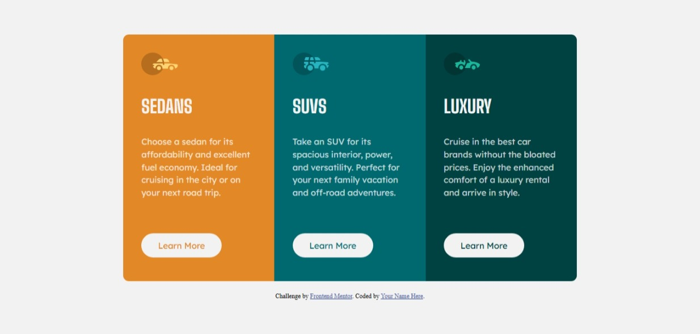
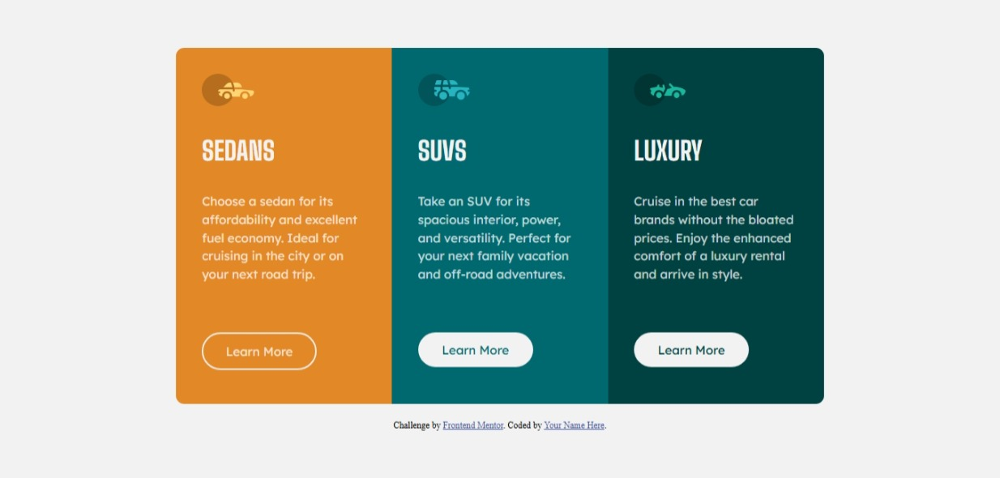

# Frontend Mentor - 3-column preview card component solution

This is a solution to the [3-column preview card component challenge on Frontend Mentor](https://www.frontendmentor.io/challenges/3column-preview-card-component-pH92eAR2-). Frontend Mentor challenges help you improve your coding skills by building realistic projects.

## Table of contents

- [Overview](#overview)
  - [The challenge](#the-challenge)
  - [Screenshot](#screenshot)
  - [Links](#links)
- [My process](#my-process)
  - [Built with](#built-with)
  - [What I learned](#what-i-learned)
  - [Continued development](#continued-development)
- [Author](#author)

## Overview

### The challenge

Users should be able to:

- View the optimal layout depending on their device's screen size
- See hover states for interactive elements

### Screenshot



**Hover State**


### Links

- Solution URL: [Solution URL](https://www.frontendmentor.io/solutions/responsive-3-column-preview-card-component-using-css-grid-and-flexbox-49pjXEm_lx)
- Live Site URL: [Live site URL](https://jesnetwd.github.io/Frontend-Mentor-3-column-preview-card-component/)

## My process

### Built with

- Semantic HTML5 markup
- CSS custom properties
- Flexbox
- CSS Grid

### What I learned

I learnt how to use CSS grid to design the layout of my webpage. I learnt how to use media queries for a responsive layout across different screen sizes.

```css
.card {
  max-width: 800px;
  display: grid;
  grid-template-columns: 1fr 1fr 1fr;
}

.learn-btn {
  background-color: var(--background-color);
  border-radius: 30px;
  display: block;
  width: 70%;
  text-decoration: none;
  padding: 12px 0;
  text-align: center;
  font-size: 15px;
  margin-bottom: 10px;
}

@media (max-width: 420px) {
  .card {
    margin: 3em auto;
    display: block;
    max-width: 300px;
  }

  .sedan {
    border-radius: 10px 10px 0 0;
  }

  .luxury {
    border-radius: 0 0 10px 10px;
  }
}

@media (min-width: 421px) and (max-width: 600px) {
  .card {
    display: block;
    max-width: 400px;
    margin: 3em auto;
  }

  .sedan {
    border-radius: 10px 10px 0 0;
  }

  .luxury {
    border-radius: 0 0 10px 10px;
  }
}

@media (min-width: 601px) and (max-width: 832px) {
  .card {
    margin: 1em;
  }
}
```

### Continued development

I would like to build more responsive layouts, write cleaner code and design better webpages.

## Author

- GitHub - [Jessica Nwoye](https://github.com/JesNetWD)
- Frontend Mentor - [@JesNetWD](https://www.frontendmentor.io/profile/JesNetWD)
